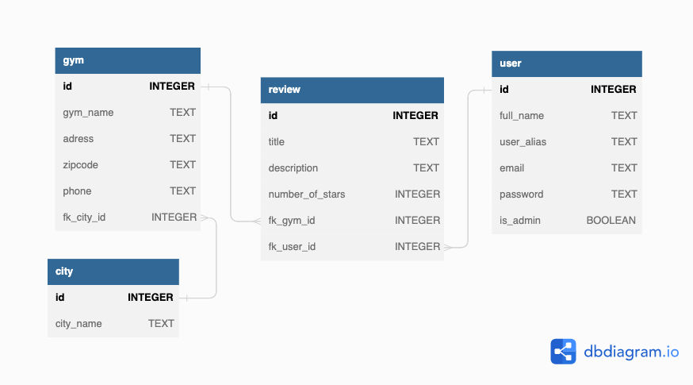

# Gym Review App

## Short description 

This was a group assignment in the api-development course which is part of the front end developer program at Medieinstitutet. The assignment was to build an SQLite REST-API (with express server) for a map/review site. We decided to build one for gym reviews.

Collaborators were: 
Anna Boye, Hama Jaff, Angelica Reuterswärd

---

## Techniques used:

node.js
SQLite
Express

---

## Database Design

---

## USERS

    full_name: "Anna Andersson",
    user_alias: "AdminAnkan",
    email: "ankanpankan@email.se",
    password: "secret",
    is_admin: TRUE,

    full_name: "Bibbi Bibsson",
    user_alias: "Bibban",
    email: "bibban@email.se",
    password: "secret",
    is_admin: FALSE,

    full_name: "Clarre Clersson",
    user_alias: "Clarre",
    email: "clarreparre@email.se",
    password: "secret",
    is_admin: FALSE,

    full_name: "Ducky Ducksson",
    user_alias: "Ducky",
    email: "ducky@email.se",
    password: "secret",
    is_admin: FALSE,

---

## Run locally:

1. Clone this repo, in your terminal run the following command : git clone https://github.com/annaboye/gym-review-site-REST-API.git
2. Install all npm packages needed, in your terminal run the following command : npm i
3. Seed your SQLite database with all data, in your terminal run the following command : npm run seedDB
4. Start server, in your terminal run the following command : npm run dev
5. You can now use the Postman Collection and test this application
